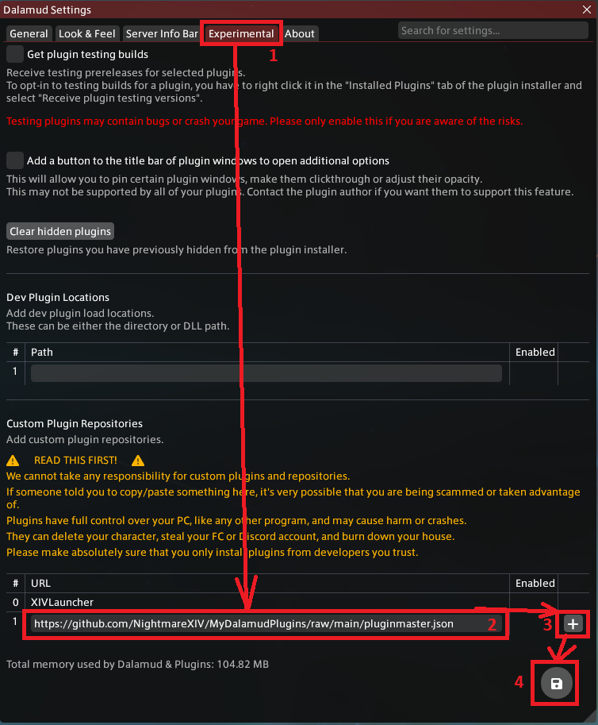

## Installation
1. Install [FFXIVQuickLauncher](https://github.com/goatcorp/FFXIVQuickLauncher?tab=readme-ov-file#xivlauncher-----) and enable Dalamud in it's settings. You have to run the game through FFXIVQuickLauncher in order for any of these plugins to work.
2. Open Dalamud settings by typing `/xlsettings` in game chat.
3. Go to "Experimental" tab.
4. Find "Custom Plugin Repositories" section, agree with listed terms if needed and paste the following link into text input field: `https://github.com/NightmareXIV/MyDalamudPlugins/raw/main/pluginmaster.json`
5. Click "Save" button.
6. Open plugin installer by typing `/xlplugins` in game chat, go to "Available plugins" section and search for a plugin you would like to install.

